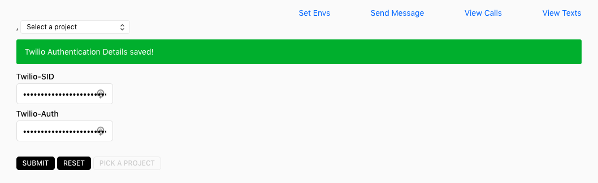

# Twilio Zeit Integration

This integration connects a user's Twilio account to Zeit to:

- Simplify adding their Twilio Account SID and Auth Token 
to their project ENV variables

- Send SMS messages to verify the connection

- View SMS and Call logs to ensure their project's Twilio 
integration is working without logging into Twilio

New users will be prompted to input their Twilio SID and Auth Token 
when the integration is first added to their account.

Afterwards, the Zeit Meta Store will store these credentials until
the user resets them or disconnects the integration.

### ENV Credentials - set easily!

Users can add their Twilio credentials once and store them for future use.
Add them as ENV variables to any Zeit project so you no longer have to
log into your Twilio dashboard just to integrate Twilio into a project.

Simply use the dropdown menu to swap between projects.

### Send a test message

Want to make sure your credentials are still working? Simply send a
message from your dashboard. This quick sanity test while developing
can help make sure that Twilio is working, even if your code might not...

### View SMS and Call Logs

Live deploys can be difficult to track whether or not the call or SMS
integration is working as anticipated when users visit.

With the on hand SMS and Call logs, you can see what messages or calls
have been placed on your Twilio account to verify user activity - or 
easily see when something has broken.

Call logs share the `to` and `from` numbers, as well as the call duration,
date and time, if the call was `inbound` or `outbound`, and the success status.

SMS logs share the `sent to` number, message, date, time and delivery
status.

### What's coming next?

Some features we'd like to implement (or receive contributions for):

- Integrate SendGrid logs and capability
- Add additional styling, like hovers on the logs
- Implement pagination with Twilio (previously supported feature that
appears to no longer exist)
- Use OAuth to integrate fully with Twilio

### What is the Twilio Connect directory?

Our initial plan was to use Twilio Connect to give users access to 
their accounts, more securely, however, it didn't work as planned.

The end result though was a (nearly) finished Twilio Connect integration.
While it doesn't fit the use case envisioned, it could easily be
its own integration with one or two more features.

For developers who want to integrate Twilio Connect's capabilities,
this integration is easy to spin up and start working on.

It also demonstrates our development work at the beginning of the Zeit
hackathon -- despite the use case not fitting, we felt it was a good 
example of what else can be done with Twilio.

##### Help! I'm getting strange errors with Twilio

Double check that your SID and Auth Tok credentials are logging correctly from
the ENV variables. If not, you may need to check the logs within your Twilio
dashboard to ensure there are no issues on your account.

If you're still experiencing problems, let us know!